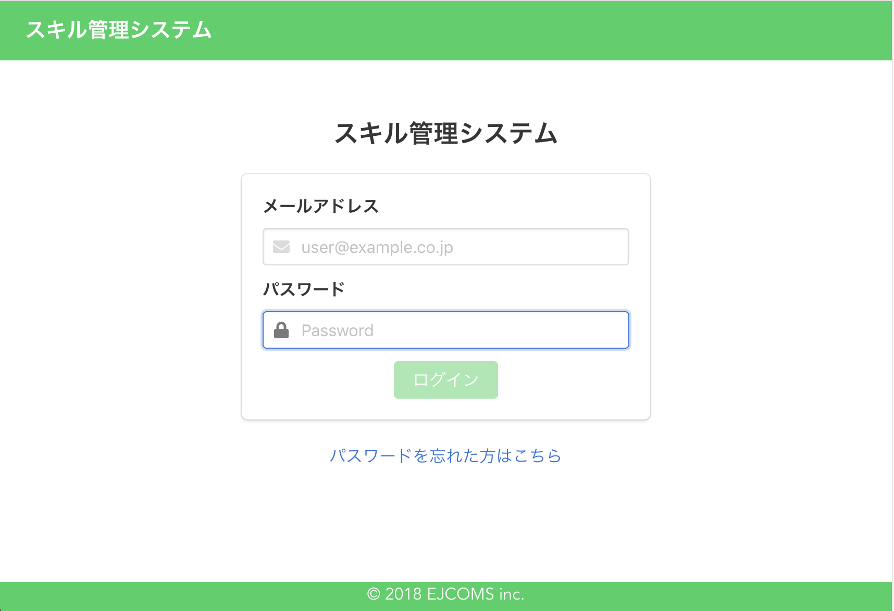
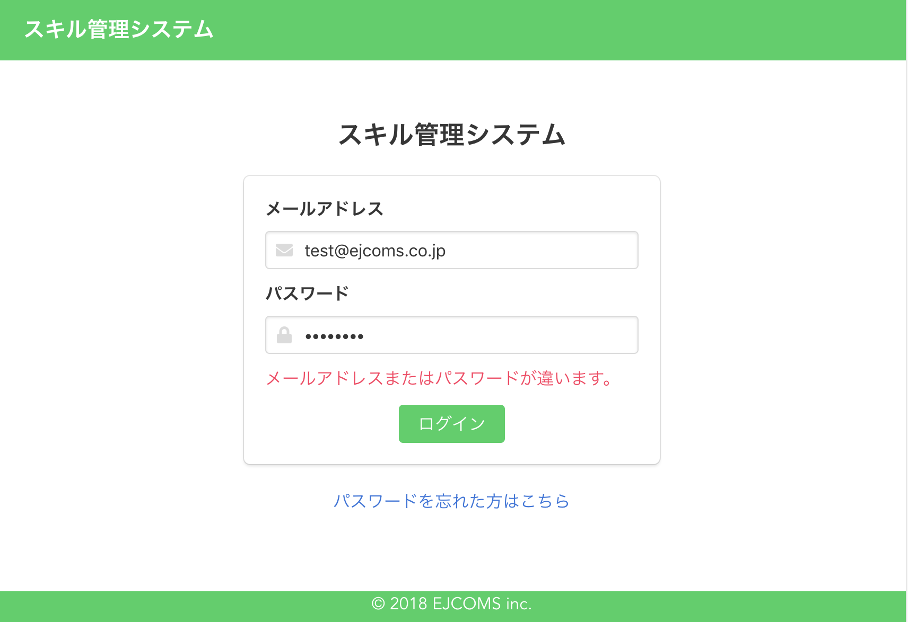

# 画面設計書 - ログイン画面

## 画面概要

ログイン処理を行う。

## 画面イメージ

### 通常表示

### エラー表示

## イベント

1. メールアドレス、パスワード入力  
メールアドレスとパスワードが両方入力された場合、ログインボタンを活性化する。  

1. 「ログイン」ボタン押下  
メールアドレス、パスワードがあっていたら、マイスキル画面に遷移。  
間違っていたらエラーメッセージを表示する。  

1. 「パスワードを忘れた方はこちら」ボタン押下  
パスワード再発行画面に遷移する。